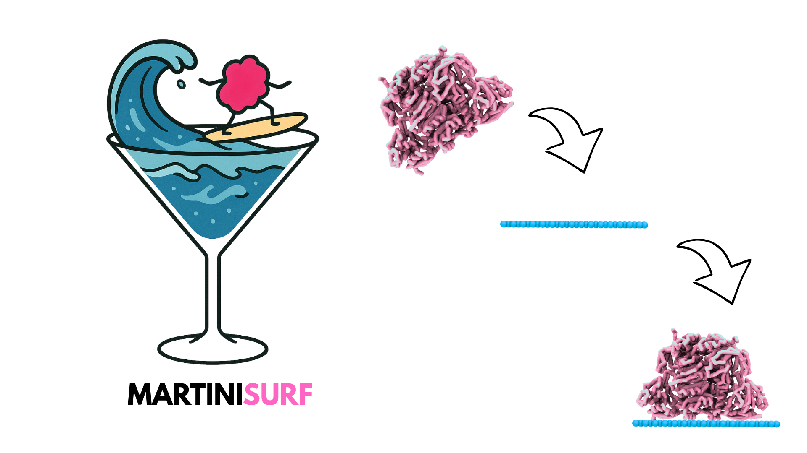

<p align="center">
  
</p>

<h1 align="center">MartiniSurf</h1>

<p align="center">
Toolkit for automated Martini protein/DNA surface-system setup, including linker-aware orientation and dynamic pull generation.
</p>

<p align="center">
  <a href="https://github.com/jjimenezgar/MartiniSurf/actions/workflows/python-ci.yml">
    
  </a>
  <a href="https://codecov.io/gh/jjimenezgar/MartiniSurf">
    
  </a>
  
  <a href="https://colab.research.google.com/github/jjimenezgar/MartiniSurf/blob/master/martinisurf/examples/colab_protein_automartini_m3.ipynb">
    
  </a>
  <a href="https://colab.research.google.com/github/jjimenezgar/MartiniSurf/blob/master/martinisurf/examples/colab_dna_automartini_m2.ipynb">
    
  </a>
</p>

## Overview
MartiniSurf builds complete GROMACS-ready simulation folders for:
- Protein-surface systems (Martini 3 workflow)
- DNA-surface systems (Martini2 DNA workflow)
- Linker-mediated immobilization workflows

Main capabilities:
- Coarse-graining via `martinize2` (protein) or `martinize-dna.py` (DNA)
- Surface generation or reuse of provided surfaces
- Classical anchor orientation or linker-based orientation
- Dynamic pull block generation in `.mdp` files (not fixed to one template)
- Automatic topology assembly (`system.top`, `system_res.top`, index groups, templates)

## Installation
```bash
conda create -n martinisurf python=3.11 -y
conda activate martinisurf
pip install -r requirements.txt
pip install -e .
```

## External Tools
MartiniSurf expects the following tools in your environment:
- `martinize2` for protein mode
- Python 2.7 for DNA mode (`martinize-dna.py`)
- GROMACS for running the generated workflows

### DSSP / Secondary Structure Notes (Protein Mode)
- `--dssp` is enabled by default in MartiniSurf protein mode.
- Following martinize2 recommendations, MartiniSurf prefers `mdtraj` for secondary-structure assignment.
- If `mdtraj` is not available, MartiniSurf can use a DSSP binary via `-dssp /path/to/dssp`.
- Important: martinize2 is only compatible with DSSP versions `3.1.4` or lower.
- In Colab, if DSSP causes failures, install `mdtraj` and avoid newer `mkdssp` binaries.

## Quick Start
### 1) Protein, classical anchor mode
```bash
martinisurf \
  --pdb 1RJW \
  --moltype Protein \
  --lx 20 --ly 20 \
  --surface-bead C1 \
  --anchor 1 8 10 11 \
  --anchor 2 1025 1027 1028 \
  --dist 10
```

### 2) DNA, classical anchor mode
```bash
martinisurf \
  --dna \
  --pdb 4C64.pdb \
  --dnatype ds-stiff \
  --surface surface.gro \
  --anchor 1 1 \
  --anchor 2 24 \
  --dist 10
```

### 3) DNA/protein linker mode
```bash
martinisurf \
  --dna \
  --pdb 4C64.pdb \
  --surface surface.gro \
  --linker linker.gro \
  --linker-group 1 1
```

## Google Colab Notebooks
- Protein workflow + optional linker generation with AutoMartini M3:
  - Notebook: `martinisurf/examples/colab_protein_automartini_m3.ipynb`
  - Open in Colab: https://colab.research.google.com/github/jjimenezgar/MartiniSurf/blob/master/martinisurf/examples/colab_protein_automartini_m3.ipynb
- DNA workflow + optional linker generation with auto_martini M2:
  - Notebook: `martinisurf/examples/colab_dna_automartini_m2.ipynb`
  - Open in Colab: https://colab.research.google.com/github/jjimenezgar/MartiniSurf/blob/master/martinisurf/examples/colab_dna_automartini_m2.ipynb

## Linker Mode Notes
- The linker topology file must exist next to linker GRO with matching basename:
  - Example: `linker.gro` -> `linker.itp`
- You can reverse linker orientation with:
  - `--invert-linker`
- For multiple linker instances, pull/index groups are generated per linker automatically.
- If not provided manually, linker distances are estimated from Martini bead-size sigma rules.

## Dynamic Pull Generation
Generated `.mdp` pull sections are built from system content:
- Classical mode: number of pulls follows number of anchor groups
- Linker mode: groups and pulls are generated per linker instance

This removes the old fixed “always 1 or 2 pulls” limitation.

## CLI Help
Use:
```bash
martinisurf -h
```
The help output is grouped by blocks:
- Input and molecule
- Martinization controls
- Surface controls
- Classical anchor mode
- Linker mode
- Output

## Output Structure
By default, MartiniSurf writes:
```text
Simulation_Files/
  0_topology/
    system.top
    system_res.top
    index.ndx
    system_itp/
  1_mdp/
  2_system/
```

## Testing
Run test suite:
```bash
pytest -q
```

## Third-Party Licensing Notice
MartiniSurf interfaces with external scientific tools and libraries that keep their original licenses.
You are responsible for complying with licenses of dependencies and external binaries in your environment.
